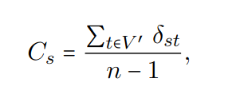

# TRABALHO PRÁTICO 3 - ALGORITMOS EM GRAFOS 

 
 
</a> 
</div>


<h6><a>Problema de centralidade em redes complexas</a></h6>

<p>Um problema de centralidade em redes complexas em grafos refere-se à análise e identificação de quais vértices são mais "centrais ou importantes na rede. Em outras palavras, busca-se entender quais vértices têm maior influência, participação ou importância na estrutura e dinâmica da rede.</p>

<h6><a>O que seria um rede complexa?</a></h6>

<p>Uma rede complexa pode ser entendida como um grande grafo sem uma estrutura definida, cujas conexões não podem ser definidas de uma forma simples. Diz-se que quanto mais importante é um vértice, maior é a sua centralidade</p>

<h6><a>Métricas de centralidade: Closeness</a></h6>

<p>O closeness quantifica os vértices mais influentes de uma rede complexa. Estes vértices podem ser utilizados para espalhar informações de forma mais rápida, eficiente e importante é este vértice para a rede. Pode-se computar o closeness de um vértice como a distância média entre o vértice e o restante dos vértices do grafo. Matematicamente, o valor do closeness Cs de vértice s pertecente a V pode ser definido como:</p>

<p align="center">

</p>

<h6><a>Introdução (introduzir e definir o problema de centralidade em grafos)</a></h6>

<p></p>

<h6><a>Algoritmos (descrever os algoritmos utilizados e analisar sua complexidade)</a></h6>

<p></p>

 <h6><a>Resultados (exibir a centralidade de cada um dos vértices do grafo, qual é o vértice mais central e uma figura do grafo mostrado os vértices, sua topologia e sua centralidade)</a></h6>

<h6><a></a></h6>

<p></p>

```c++
```


| Comando                |  Função                                                                                           |                     
| -----------------------| ------------------------------------------------------------------------------------------------- |
|  `make clean`          | Apaga a última compilação realizada contida na pasta build                                        |
|  `make`                | Executa a compilação do programa utilizando o g++, e o resultado vai para a pasta build           |
|  `make run`            | Executa o programa da pasta build após a realização da compilação                                 |

# Alunos

Estudantes do curso de AEDs III de 2024 da Universidade Federal de Alfenas UNIFAL-MG.

CAIO FERNANDO DIAS
FELIPE DE GODOI CORREA
MATHEUS REIS DE LIMA


# Contato

<!-- <div style="display: inline-block;">
<a href="https://t.me/caio_fer_dias">
 </div> -->

